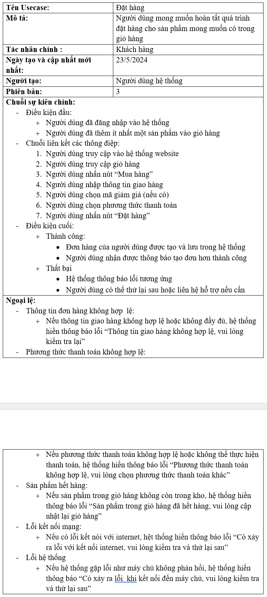
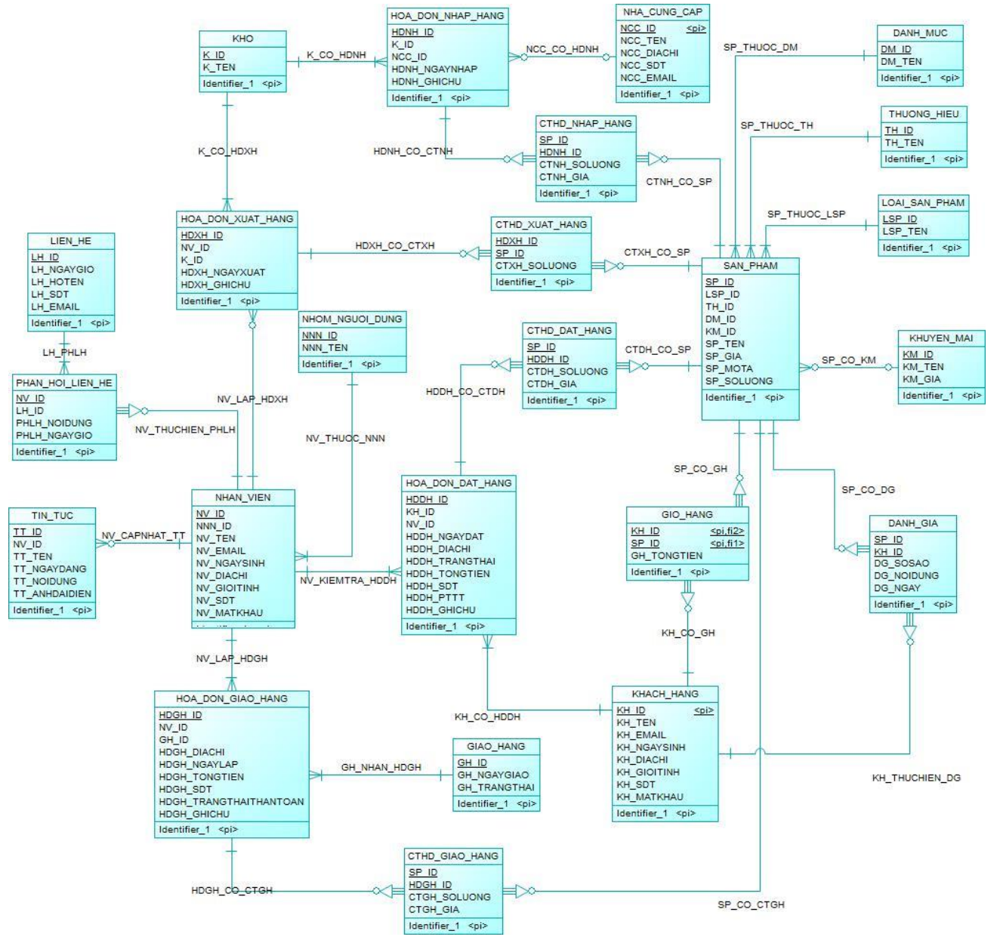
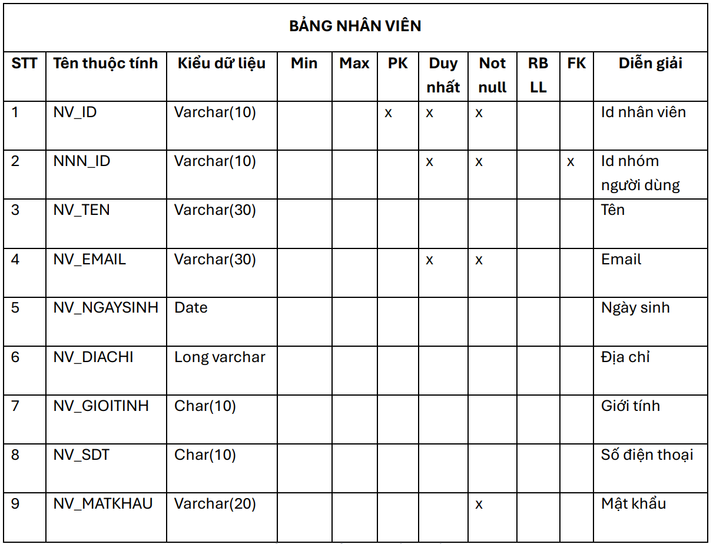
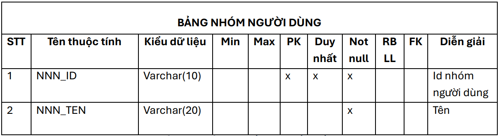

## Phân Tích và Thiết Kế Cơ Sở Dữ Liệu cho Website Bán Hàng 

### 1. Tổng Quan Dự Án
Dự án Phân Tích và Thiết Kế Cơ Sở Dữ Liệu cho Website Bán Hàng nhằm tạo ra một cấu trúc cơ sở dữ liệu vững chắc để hỗ trợ các chức năng của một nền tảng bán hàng trực tuyến. Cơ sở dữ liệu này được thiết kế để quản lý sản phẩm, khách hàng, đơn hàng, thanh toán và các thành phần cần thiết khác một cách hiệu quả, đảm bảo tính toàn vẹn, bảo mật và khả năng mở rộng.

Hệ thống sẽ lưu trữ thông tin chi tiết về sản phẩm, người dùng, đơn hàng, danh mục, đánh giá và các khía cạnh quan trọng khác của một cửa hàng trực tuyến, hỗ trợ giao dịch theo thời gian thực và cung cấp một nền tảng dữ liệu đáng tin cậy cho hoạt động và nhu cầu phân tích kinh doanh của website.

### 2. Các giai đoạn thiết kế 
#### 2.1 Phân tích và mô tả hệ thống 
- Phân tích hệ thống của các trang thương mại điện tử lớn như Tiki và Shopee bao gồm nhiều bước để xác định và thiết kế các chức năng, quy trình kinh doanh và yêu cầu người dùng, phân tích cơ sở dữ liệu,.. nhằm đáp ứng nhu cầu phức tạp của khách hàng và nhà cung cấp. 
  
  
  
  
- Mô tả  hệ thống nhằm xác định các chức năng và các yêu cầu  đã phân tích từ các sàng thương mại điện tử lớn để xác định rõ các quy trình tiếp theo. Mô tả là bước thiết yếu để hiểu rõ hệ thống cần và phải có những gì. 
  
  
  
  ##### => Các chức năng sau khi phân tích và mô tả hệ thống: 
- **Admin**
    - Quản lí kho
    - Quản lí người dùng
    - Quản lí doanh thu
- **Nhân viên**
    - Quản lí khuyến mãi
    - Quản lí danh mục
    - Quản lí tồn kho 
    - Quản lí đơn hàng
    - Quản lí khách hàng
    - Quản lí sản phẩm
    - Quản lí tin tức 
    - Quản lí thống kê
    - Quản lí vận chuyển
- **Giao hàng** 
    - Quản lí đơn giao 
    - Quản lí vận chuyển
- **Khách hàng** 
    - Quản lí giỏ hàng
    - Quản lí đơn hàng cá nhân
    - Quản lí tài khoản
    - Đăng ký tài khoản
    - Tìm kiếm sản phẩm, xem sản phẩm, liên hệ,...
  #### 2.2 Đặc tả usecase 
- Đặc tả usecase sẽ mô tả một chức năng cụ thể đã phân tích ở hệ thống cung cấp cho người dùng và các bước thực hiện của từng chức năng đó.
  ###### ***Usecase Đăng ký***
  
  ###### ***Usecase Đặt hàng***
  
#### 2.3 Thiết kế thành phần dữ liệu 
  ###### ***Mô hình dữ liệu ở mức quan niệm (CDM)***

  ###### ***Mô hình dữ liệu ở mức luận lý (LDM)***

###### ***Mô hình dữ liệu ở mức vật lý (PDM)***

#### 2.4 Thiết kế cơ sở dữ liệu 




### 3. Công nghệ sử dụng
- Hệ quản trị cơ sở dữ liệu: MySQL 
- Công cụ hộ trợ thiết kế: StarUML, PowerDesigner. 
### 4. Hướng dẫn cài đặt 
  1. Clone repository:
   ```bash
    git clone https://github.com/haidangsondev/Database_design
   ```
  2. Cài đặt các phần mềm cần thiết: 
    [StarUML](https://staruml.io/download/)
    [PowerDesigner](https://www.powerdesigner.biz/)
  3. Import các gói cần thiết 
   - Mở StarUML và import file ***US_Ecommerce***
   - Mở PowerDesigner và import file ***CDM.cdm, LDM.ldm và PDM.pdm***
### 5. Kết luận
Việc phân tích và thiết kế cơ sở dữ liệu cho website bán hàng là bước quan trọng, đóng vai trò nền tảng để đảm bảo hệ thống hoạt động ổn định, hiệu quả và đáp ứng các yêu cầu nghiệp vụ. Với cấu trúc rõ ràng và tối ưu, cơ sở dữ liệu này không chỉ hỗ trợ quản lý sản phẩm, khách hàng, đơn hàng mà còn cung cấp khả năng mở rộng dễ dàng khi cần tích hợp thêm các tính năng mới như quản lý khuyến mãi, phân tích dữ liệu kinh doanh, hoặc tích hợp với các hệ thống bên ngoài.

Thiết kế này đã được thực hiện với nguyên tắc chuẩn hóa dữ liệu, đảm bảo tính toàn vẹn và nhất quán, đồng thời sẵn sàng triển khai trên các nền tảng cơ sở dữ liệu phổ biến.